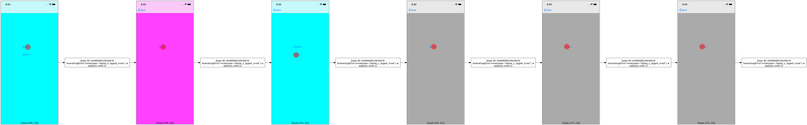
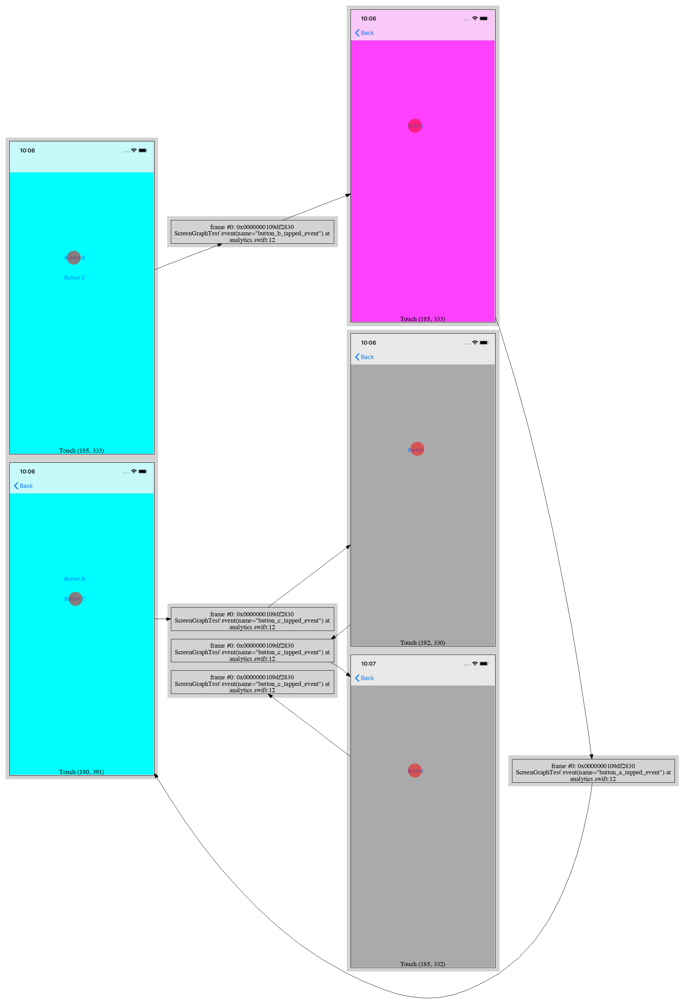

Screengraph for LLDB
====================

LLDB script for creating (dot/graphviz) graphs of iOS screens based on breakpoints.

Linear graph:

Graph with re-entry:

Typical usage include mapping analytics events to view controllers.

## Usage

First, import the script (either manually or in `.lldbinit`) into the debugging session:

    (lldb) command script import /path/to/screengraph.py

Second, start a screengraph session:

    (lldb) screengraph start
    
Screengraph will use all enabled breakpoints at the time `screengraph start` is run. When hit, those breakpoints will:

- take a screenshot
- add the function name and arguments, line entry and screenshot to the graph
- continue (i.e. the debugger won't suspend the process at those breakpoints)

Optionally, breakpoints can be created or enabled after `screengraph start` is run. Those breakpoints will not be used by screengraph; they will not take any screenshot, not add anything to the graph, and will stop.

Optionally, the session can be ended with (typically not needed if stopping the app): 
    
    (lldb) screengraph stop

Finally, the graph and screenshots can be found under the home directory, i.e. in `$HOME/screengraph`. A PNG image of the graph can be generated with:

    dot -Tpng:gd graph.dot > graph.png

An example output is available in [documentation](documentation/example output/).

## Frequently Asked Questions

### Why does the app not stop at breakpoints anymore?

Screengraph uses breakpoints created before `screengraph start` is run. When one of those breakpoints is hit, screengraph takes a screenshot, adds a node to the graph, and continues.

To have the app stop at certain breakpoints, created or enable them after running `screengraph start`.

### Why does the app stop at a breakpoint?

The breakpoint was most probably created or enabled before `screengraph start` was run. 

Run `screengraph stop` and `screengraph start` again.

### Can screengraph generate other types of output?

Screengraph can also output a plain list of breakpoint hits (not enabled by default).

Adding more outputs should be easy; use `Output` as base class.

### What's `ScreenGraphTest` for?

It's only used for development. It is not needed for using screengraph.

### Does screengraph work with mac apps?

Not as it is right now, but it should be easy to add. Look at `EvaluateExpression` calls for iOS-specific code to be replaced by Mac code. Feel free to submit pull requests.

### Does screengraph work on a device?

It should (not tested), as long as the debugger is connected.

### Can other outputs be added?

That should be easy to add. Extend the `Output` base class and register your new output class in `ScreenGraphCommand`'s `make_outputs`. Feel free to submit pull requests.

## References

- [graphviz](https://www.graphviz.org/gallery/)
- [lldb python reference](https://lldb.llvm.org/python-reference.html)
- [lldb python api](https://lldb.llvm.org/python_reference/index.html)
- [lldb python examples](https://github.com/llvm/llvm-project/tree/master/lldb/examples/python)
